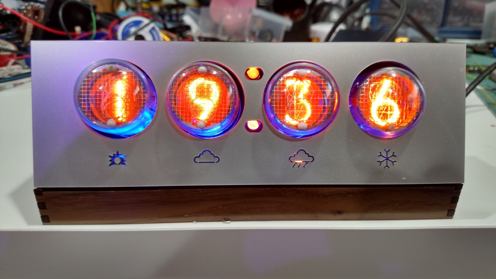

# nixienet
Connecting 1960's tube tech to 2010's Wifi chips!

This Wifi gadget connects to time and weather forecast servers and uses Nixie tubes to display the current time and upcoming weather.

It's one of the most full designs I've ever made, from insides to outsides. So fun :)

